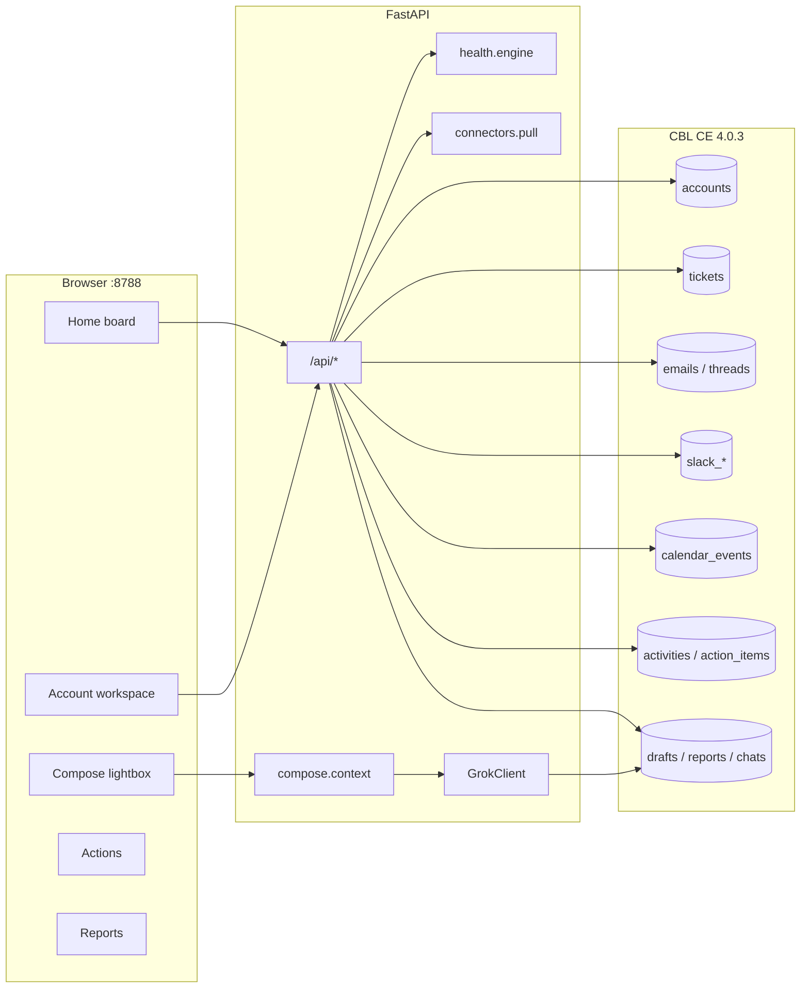
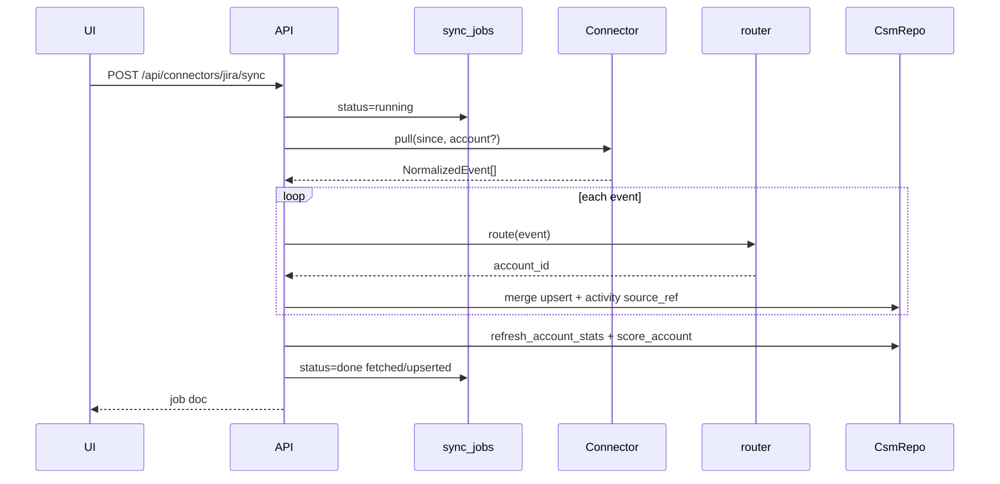

# csm_dashboard — system design

| Field | Value |
| --- | --- |
| **Title** | Customer Success Manager Dashboard — local multi-account desk |
| **Author** | Fujio Turner |
| **Date** | 2026-08-17 |
| **Status** | Draft |
| **Version (product)** | 0.1.0 first-ship lock · **living desk is 0.1.91** — see [`ROADMAP.md`](ROADMAP.md) |
| **License** | Apache License, Version 2.0 (Copyright 2026 Fujio Turner; contact mail@fuj.io) |
| **Repo (locked)** | `/Users/fujioturner/Documents/git_folders/fujio-turner/csm_dashboard` |
| **Not** | A Salesforce / Gainsight replacement. Local single-operator desk. |

---

## Overview

Customer Success Managers live in five tabs — Jira, Gmail / Outlook, Slack, Calendar, and a notes app — while owning **eight to twenty-five enterprise accounts at once**. They lose threads, miss renewals, write emails without ticket or Slack context, and scramble Friday afternoon to produce a weekly report. There is no local desk that joins those sources per account, colors them so the eye can switch books instantly, and lets Grok draft with the *right* context.

**csm_dashboard** is a laptop product: one operator, one process, one Couchbase Lite Community 4.0.3 file. Stack: Python 3.11+, FastAPI, vanilla IIFE JS, ctypes `libcblite`, Grok at `https://api.x.ai/v1`, Apache License 2.0. Official Couchbase Lite has no Python SDK — the ctypes wrapper lives in this repo (`src/csm_dashboard/storage/cblite.py`). Do not add Enterprise vector-index binds (Community pin).

v0.1 shipped a working desk on **seed fixtures + connector stubs**. **Living product (0.1.90):** live Jira / Slack / Teams / Gmail / Calendar, SMTP send after confirm, Agenda Day/Week/Month, timeline Now, slack / teams tab, Tagify chips on multi-value fields. IMAP / Zendesk / Pydantic AI still sit on [`ROADMAP.md`](ROADMAP.md). This file remains the original v0.1 design lock — where it says send is `409 send_disabled_v0_1`, the desk now uses `send_not_configured` when SMTP is off and delivers when SMTP is live.

---

## Background & Motivation

### Current state

| Tool | What the CSM uses it for | What is lost |
| --- | --- | --- |
| Jira | Support + project tickets | Account-level health; “is this P1 on NORTHWIND or ACME?” |
| Gmail / M365 | Customer email chains | Ticket + Slack context when composing |
| Slack | Account channels / war rooms | Search across accounts; durable next steps |
| Calendar | QBRs, escalations, PS workshops | “When did we last sit with the champion?” |
| Notes / Docs | Weekly status | Friday scramble; no structured action items |

This is a **post-sale** desk. A field-sales finder (zip / map / motions / `place_id`) is the wrong grain: CSM work is renewals, PS projects, a multi-source timeline, and account color/abbr.

### Pain this product removes

1. **Context switching.** Color chip + 2–6 char `abbr` on every row so the operator never replies to ACME from a NORTHWIND thread.
2. **Blind compose.** Drafts are built from ticket summaries + thread tail + Slack snippets + recent calendar, not from memory.
3. **Invisible follow-ups.** Action items are first-class (`action_items`), not regex on notes (sales_ops constraint 7: “Do not grow CRM on note regex”).
4. **Friday reports.** `prompts/weekly_report.json` + archived `reports` docs.

### Bind address

Listen on **`127.0.0.1:8788`**. Database file: `data/csm_dashboard.cblite2`.

---

## Goals & Non-Goals

### Goals (v0.1)

- New git repo at the locked path (see [Repo layout](#repo-layout-locked)).
- One-operator local desk: Home board, Account workspace, Compose, Actions, Reports, Settings, Help.
- Multi-account identity: every durable customer-owned document carries `account_id`. UI always shows **color chip + `abbr`**.
- CBL CE 4.0.3 via a **copied** ctypes wrapper (`src/csm_dashboard/storage/cblite.py` + `cbl_store.py` + `errors.py` + `memory.py`). Pin Community in `cblite_config.json`.
- JSON Schema 2020-12 under `schema/`. Hand-maintained OpenAPI 3.1 at `docs/openapi.yaml`.
- Connector **protocol + stub/fixture pull**. Seed 3 fake enterprise accounts with tickets, threads, Slack, calendar, a PS project, people, and actions.
- Grok surfaces behind `prompts/*.json`. If `XAI_API_KEY` is absent, compose/report use template fallbacks; chat streams a static SSE fallback and still writes a `chats` doc (not HTTP 400).
- First-party operator fields (`unread`, `triage`, `pin`, `prep_note`) are **writable** via `PATCH /api/.../operator` in v0.1.
- Drafts persist; **v0.1 does not send mail**. `POST /api/drafts/{id}/send` returns `409` with `reason=send_disabled_v0_1`.
- Default listen **`127.0.0.1:8788`**. `make ci` = `compileall` + `node --check` + pytest.
- Timeline for one account lists in **&lt; 300 ms** local SQL++ at the quantified load (see [Scale](#scale--performance)), using composite indexes and Slack-root-only activities.

### Non-goals (v0.1 and explicit later)

| Non-goal | Why |
| --- | --- |
| Live OAuth (Google, M365), live Jira, live Slack, live IMAP | Roadmap. Stubs + fixtures first. |
| Auto-send email or Slack | Confirm-before-send is a hard rule. |
| Multi-user / SSO / RBAC | v1 is this machine. No auth. |
| Embedding this desk in another product’s admin UI | Different job, different store. Keep this repo standalone. |
| Depending on another repo’s ctypes wrapper | License isolation. The wrapper lives here. |
| Couchbase Server, Capella replicator, React Native | Future shape; not v0.1. |
| CBL EE vector index | Community pin. Search is SQL++ + FTS `MATCH`/`RANK` + Grok. Official C FTS uses `MATCH(indexName, query)` — **`SEARCH()` is Server SQL++** ([C FTS docs](https://docs.couchbase.com/couchbase-lite/current/c/fts.html)). |
| React, bundler, Tailwind, DaisyUI, TypeScript | Vanilla HTML + one CSS + IIFE JS. |
| Nested backticks inside JS template literals | Breaks the IIFE parse. `make check-js`. |
| Salesforce, Gainsight, or a hosted CSM cloud | Local desk. Keys stay on disk. |
| Electron + SQLite | CBL is the store so the same JSON docs can later push/pull to Capella without a remodel. |
| Hard-coding semver in JS | SoT is `src/csm_dashboard/__init__.py` → `__version__`. Badge from `/api/status`. |
| Metrics catalogue / Prometheus | v0.1 is structured logs only. |
| Storing OAuth tokens or SMTP passwords in CBL | Secrets in `.env` / `data/secrets.json` only. |

---

## Proposed Design

### Architecture

```text
Browser  (vanilla JS IIFE + one CSS; hash routes)
    │  same-origin /api
    ▼
FastAPI  (Python 3.11+, uvicorn, :8788)
    │── connectors/*     (Protocol; v0.1 = StubConnector + fixtures)
    │── ingest/route.py  (domain → account_id)
    │── ingest/merge.py  (sources.<connector> vs first-party)
    │── health/engine.py (rules 0–100 + optional Grok overlay)
    │── compose/context.py + compose/grok.py
    │── chat/grok.py     (account-scoped tools)
    │── prompts/*.json
    │── xAI  https://api.x.ai/v1
    ▼
CsmRepo  (Store Protocol)
    ├── CBLStore  →  ctypes CBL  →  libcblite CE 4.0.3
    │                 data/csm_dashboard.cblite2
    └── MemoryStore (unit tests; same Protocol)
```

One process owns the `.cblite2` file. Writes are serialized with `threading.RLock` exactly as [`CBLStore`](/Users/fujioturner/Documents/git_folders/fujio-turner/sales_ops/src/sales_ops/storage/cbl_store.py) does. Lists and filters are **SQL++** (`WHERE` + `ORDER BY` + interpolated `LIMIT`/`OFFSET`). Parameterized `LIMIT` fails on this CE build — sales_ops already clamps ints and inlines them; copy that rule.



### Why this stack (locked)

- Official CBL has **no Python SDK**. ctypes + `libcblite` is the path; the wrapper is `src/csm_dashboard/storage/cblite.py`.
- Pin **Community** in `cblite_config.json`. Vector index is EE-only — do not bind it.
- FastAPI + vanilla JS is enough for one operator. **No nested backticks** inside template literals (`make check-js` = `node --check`).

### Repo layout (locked)

Package layout:

```text
csm_dashboard/
  AGENTS.md
  LICENSE
  LICENSE
  Makefile
  Dockerfile
  docker-compose.yml
  pyproject.toml
  cblite_config.json
  config.example.json
  config.json                 # gitignored if customized; example is committed
  .env.example
  .gitignore
  README.md
  ROADMAP.md
  docs/DESIGN.md              # this document, checked in
  docs/openapi.yaml
  guides/OPENAPI.md
  guides/HTML_CSS.md
  guides/SCHEMA.md
  guides/LOGGING.md
  schema/*.schema.json
  prompts/*.json
  fixtures/seed/              # ACME, NORTHWIND, GLOBEX
  src/csm_dashboard/
    __init__.py               # __version__ = "0.1.0"
    __main__.py               # uvicorn factory, port from Settings
    config.py
    logging_setup.py
    prompts.py
    storage/
      __init__.py
      errors.py
      cblite.py               # copy/adapt sales_ops CBL class; no vector binds
      cbl_store.py            # COLLECTIONS, INDEXES, SQL++ helpers
      memory.py               # MemoryStore
      repo.py                 # Store Protocol + CsmRepo
    connectors/
      base.py                 # Connector protocol + NormalizedEvent
      registry.py
      stub.py
      smtp_imap.py            # stub class in v0.1
      google_mail.py
      microsoft365.py
      jira.py
      slack.py
      google_cal.py
      m365_cal.py
    ingest/
      route.py                # domain / project key / channel → account_id
      merge.py
      activities.py           # emit timeline rows with source_ref dedup
    health/
      engine.py
    compose/
      context.py
      grok.py
      redact.py
    chat/
      grok.py
      tools.py
    seed/
      load.py
    web/
      app.py                  # create_app(repo=None) factory + lifespan
      templates/index.html
      static/app.js
      static/app.css
      static/compose.js       # optional split; still node --check
      static/favicon.svg
      static/logo.svg
  tests/
    conftest.py
    test_schema.py
    test_repo.py
    test_merge.py
    test_route.py
    test_health.py
    test_compose_context.py
    test_redact.py
    test_markup.py
    test_prompts.py
    test_cblite_optional.py
    test_openapi_paths.py
    test_seed_idempotent.py
    test_app_memory.py        # TestClient(create_app(repo=...))
```

### Boot

Pattern [`sales_ops/src/sales_ops/__main__.py`](/Users/fujioturner/Documents/git_folders/fujio-turner/sales_ops/src/sales_ops/__main__.py) + [`web/app.py` `lifespan`](/Users/fujioturner/Documents/git_folders/fujio-turner/sales_ops/src/sales_ops/web/app.py):

```python
# src/csm_dashboard/__main__.py
def main() -> None:
    configure_logging()
    settings = load_settings()
    uvicorn.run(
        "csm_dashboard.web.app:create_app",
        factory=True,
        host=settings.host,
        port=settings.port,  # 8788
        reload=False,
    )
```

Until **PR 2**, `create_app` is an HTTP stub (`/healthz`, `/`, no CBL). After PR 2, `lifespan` matches sales_ops: it opens `CBLStore(settings.db_path)`, wraps `CsmRepo(store)`, logs `csm.boot version=… db=… host=… accounts=…`. If `libcblite` is missing on that path, raise `CouchbaseLiteNotAvailable` and refuse to serve — no silent MemoryStore in production. Tests inject a store via `create_app(repo=CsmRepo(MemoryStore()))` (see [CsmRepo surface](#csmrepo-surface-locked)) or call `open_store(None, memory=True)` directly.

Default bind is **`127.0.0.1`**. Listening on all interfaces requires an explicit `CSM_DASHBOARD_BIND=0.0.0.0` (or `server.host` set to that value) and logs `csm.boot.bind host=0.0.0.0 auth=none`.

### Config vs secrets

Same split as sales_ops `config.py` (`load_settings` / `load_secrets` / `save_secrets`).

**`config.json`** (non-secrets; restart after structural changes):

```json
{
  "server": { "host": "127.0.0.1", "port": 8788 },
  "cblite": { "db_path": "data/csm_dashboard.cblite2" },
  "xai": {
    "base_url": "https://api.x.ai/v1",
    "default_model": "grok-4.6",
    "models": ["grok-4.6", "grok-4.5", "grok-4-fast"]
  },
  "operator": {
    "name": "Jordan Lee",
    "email": "jordan@example.com",
    "role": "csm"
  },
  "desk": {
    "tagline": "Accounts · tickets · mail · Slack",
    "thread_tail": 8,
    "slack_tail": 20,
    "max_context_chars": 24000,
    "timeline_page": 50,
    "home_meetings_hours": 24
  },
  "accounts": {
    "abbr_min": 2,
    "abbr_max": 6,
    "default_color": "#0B3D91"
  },
  "health": {
    "ticket_max": 25,
    "responsiveness_max": 20,
    "engagement_max": 20,
    "actions_max": 15,
    "renewal_max": 20
  },
  "connectors": {
    "smtp_imap": { "mode": "stub" },
    "google_mail": { "mode": "stub" },
    "microsoft365": { "mode": "stub" },
    "jira": { "mode": "stub" },
    "slack": { "mode": "stub" },
    "google_cal": { "mode": "stub" },
    "m365_cal": { "mode": "stub" }
  }
}
```

**`.env` / `data/secrets.json`** (gitignored; env wins if both set):

| Env | secrets.json key | Purpose |
| --- | --- | --- |
| `XAI_API_KEY` | `xai_api_key` | Grok |
| `CSM_DASHBOARD_PORT` | — | override port |
| `CSM_DASHBOARD_BIND` | — | override `server.host`. Default `127.0.0.1`. Set `0.0.0.0` to listen on LAN (logged, no auth). |
| `CSM_DASHBOARD_DB_PATH` | — | override db path |
| `CSM_DASHBOARD_SECRETS` | — | override secrets path |
| `CSM_DASHBOARD_PROMPTS` | — | override prompts dir (`prompts_dir()`) |
| `CSM_DASHBOARD_FIXTURES` | — | override fixtures dir (`fixtures_dir()`) |
| `CBLITE_LIB_PATH` | — | libcblite |
| _(later)_ `SMTP_*` / `IMAP_*` | `smtp_*` / `imap_*` | mail |
| _(later)_ OAuth client + refresh | `google_oauth`, `m365_oauth` | Google / Graph |
| _(later)_ `JIRA_BASE_URL` + token | `jira_*` | Jira |
| _(later)_ `SLACK_BOT_TOKEN` / user | `slack_*` | Slack |

`PUT /api/settings/keys` writes **only** `data/secrets.json` (sales_ops `save_secrets`). Never persist keys on the `settings` CBL document.

### ctypes wrapper (copy rules)

ctypes wrapper in this repo:

| File | Keep | Drop / change |
| --- | --- | --- |
| `cblite.py` | `CBL` class, `FLSlice`, open/close, collections, JSON CRUD, value + FTS indexes, `execute_query`, transactions, expiration | Do not add `CBLVectorIndexConfiguration` / vector binds |
| `errors.py` | `CouchbaseLiteError`, `CouchbaseLiteNotFound`, `CouchbaseLiteNotAvailable` | unchanged |
| `cbl_store.py` | `RLock`, strip `_id`/`_created` on save, `_unwrap_row`, interpolated LIMIT, FTS `MATCH`/`RANK` | New `COLLECTIONS` / `INDEXES` (below) |
| `memory.py` | `MemoryStore` with `save/get/purge/list_all/count/query_all` only | **No** SQL++ on MemoryStore. Repo methods filter in Python (sales_ops `page_businesses` + `getattr(store, "query_businesses", None)` pattern) |
| `repo.py` | `Store` Protocol, `utcnow()`, `open_store()` | `CsmRepo` — locked method list below; **no** `place_id` / `territories` |

CBL **rejects a top-level `_id` property**. `CBLStore.save` must strip `_id` and `_created` before `json.dumps`, identical to sales_ops:

```python
def save(self, collection: str, doc_id: str, doc: dict) -> None:
    clean = {k: v for k, v in doc.items() if k != "_id" and k != "_created"}
    payload = json.dumps(clean, default=str)
    with self._lock:
        self._cbl.save_document_json(self._cols[collection], doc_id, payload)
```

Repo methods re-attach `"_id": doc_id` on the way out for the API.

### CsmRepo surface (locked)

`web/app.py` **must not contain SQL++**. Handlers call `CsmRepo` only. `CBLStore` may implement `query_*` helpers; `CsmRepo` does `fn = getattr(self.store, "page_timeline", None)` then SQL++ or `query_all` + Python filter (same branch as sales_ops `SalesRepo.list_notes` / `page_businesses`).

`create_app(repo: CsmRepo | None = None)` — if `repo` is passed, lifespan skips `CBLStore` and uses it. That is the API-test seam (sales_ops never added this; CSM’s list surface is larger, so it is required). `make ci` without libcblite still exercises list/filter/operator-patch via `TestClient(create_app(repo=CsmRepo(MemoryStore())))`.

Locked methods (add helpers only if a new collection lands):

| Method | Role |
| --- | --- |
| `counts()` | `{collection: n}` |
| `get_settings` / `save_settings` | CBL `settings` doc |
| `create_account` / `get_account` / `get_account_by_abbr` / `patch_account` / `list_accounts` | abbr unique, case-fold lookup; **slug immutable** after create |
| `create_person` / `get_person` / `patch_person` / `list_people` | filter `account_id`, `kind` |
| `create_project` / `get_project` / `patch_project` / `list_projects` | |
| `upsert_ticket` / `get_ticket` / `patch_ticket_operator` / `page_tickets` | merge + operator-only patch |
| `upsert_email` / `get_email` / `patch_email_operator` / `page_emails` | id from [email identity](#email-and-thread-identity-locked) |
| `upsert_thread` / `get_thread` / `patch_thread_operator` / `page_threads` | attach email → existing thread |
| `upsert_slack_channel` / `upsert_slack_message` / `patch_slack_operator` / `page_slack` | `page_slack(account_id, channel_id, limit, before_ts)` |
| `upsert_calendar` / `patch_calendar_operator` / `page_calendar` | `from`/`to` on `start_at` |
| `create_action` / `get_action` / `patch_action` / `page_actions` | `due=overdue\|today\|all` |
| `touch_next_action(account_id)` | soonest open action → `accounts.next_action` |
| `refresh_account_stats(account_id)` | cache `stats.*`; not SoT |
| `score_account(account_id)` | rules engine; honors override-if-set |
| `add_note` / `list_notes` | random `note:{hex12}` |
| `upsert_activity_by_source_ref` / `add_operator_activity` / `page_timeline` | see [activity identity](#activity-identity-locked) |
| `create_draft` / `get_draft` / `patch_draft` / `list_drafts` | |
| `create_report` / `get_report` / `list_reports` | |
| `save_chat` / `get_chat` / `list_chats` | |
| `save_job` / `get_job` / `list_jobs` | |
| `seed_from_dir` / `reset_store` | fixtures; reset keeps `settings` |

`CBLStore` SQL++ lives next to these methods (or as `query_timeline` etc. called only from `CsmRepo`). Interpolated `LIMIT`/`OFFSET` stay in the store layer.

### Docker

Clone [`sales_ops/Dockerfile`](/Users/fujioturner/Documents/git_folders/fujio-turner/sales_ops/Dockerfile) + [`docker-compose.yml`](/Users/fujioturner/Documents/git_folders/fujio-turner/sales_ops/docker-compose.yml):

- `FROM python:3.12-slim`
- Read `cblite_config.json` (`version=4.0.3`, `edition=community`, `platform=linux-x86_64`)
- `wget` `https://packages.couchbase.com/releases/couchbase-lite-c/${VERSION}/couchbase-lite-c-${EDITION}-${VERSION}-${CFG_PLATFORM}.tar.gz`
- `CBLITE_LIB_PATH=/opt/cblite/lib/x86_64-linux-gnu/libcblite.so`
- `CSM_DASHBOARD_DB_PATH=/data/csm_dashboard.cblite2`
- **Also `COPY`** (sales_ops Dockerfile omits fixtures — do not clone that gap): `COPY fixtures /app/fixtures`, `COPY prompts /app/prompts`, plus `src`, `schema`, `docs`, `guides`, `config.example.json`, `cblite_config.json`
- `EXPOSE 8788`
- `CMD ["python", "-m", "csm_dashboard"]`
- compose: `platform: linux/amd64`, publish **`127.0.0.1:${CSM_DASHBOARD_PORT:-8788}:8788`** (not `8788:8788` — that would expose PII on the LAN), volume `./data:/data`, `config.json` ro-mount, healthcheck `urllib.request.urlopen('http://127.0.0.1:8788/healthz')`
- Resolve trees at runtime from `ROOT` (same as sales_ops finds `docs/openapi.yaml`): `prompts_dir()` / `fixtures_dir()` walk parents or honor `CSM_DASHBOARD_PROMPTS` / `CSM_DASHBOARD_FIXTURES`. Do not rely on setuptools package-data for fixtures/prompts.

Apple Silicon runs amd64 because Community libcblite is x86_64 (sales_ops README).

### Makefile

```make
ci: lint check-js test

lint:
	$(PY) -m compileall -q src tests

check-js:
	node --check src/csm_dashboard/web/static/app.js
	# every additional static/*.js

test:
	$(PYTEST) -q

run:
	$(PY) -m csm_dashboard
```

`pyproject.toml`: `name = "csm-dashboard"`, `requires-python = ">=3.11"`, deps `fastapi>=0.115`, `uvicorn[standard]>=0.32`, `httpx>=0.27`, `python-dotenv>=1.0`, `pydantic>=2.8`. Dev: `pytest`, `pytest-asyncio`, `jsonschema`, `pyyaml`. Script: `csm-dashboard = "csm_dashboard.__main__:main"`. Package data: `web/static/*`, `web/templates/*` (UI only). Fixtures and prompts stay at **repo root** and are resolved by `fixtures_dir()` / `prompts_dir()` — Docker `COPY`s them to `/app/`.

`config.py` also writes `data/secrets.json` mode `0o600` on save (`os.chmod`). Community CBL does **not** encrypt the `.cblite2` file; FileVault (or equivalent) is the disk story — do not imply Lite encryption.

---

## Data model

Scope **`_default`**. Documents are JSON. Every customer-owned durable doc has `account_id` (the accounts collection’s own id, format `acct:{slug}`).

### Collections, doc ids, `type`

| Collection | Doc id | `type` | Role |
| --- | --- | --- | --- |
| `accounts` | `acct:{slug}` | `account` | Enterprise customer; color/abbr/domains/routing/health/contract/teams |
| `people` | `person:{token}` | `person` | Customer contacts + internal account/PS team |
| `projects` | `proj:{token}` | `project` | PS / implementation / QBR workstreams |
| `tickets` | `tkt:{source}:{key}` | `ticket` | Normalized Jira (or stub) issues. `key` is `ACME-12` |
| `emails` | `em:{sha256(...)[:20]}` | `email` | One message. See [email identity](#email-and-thread-identity-locked) — **never random** |
| `threads` | `thr:{sha256(...)[:16]}` | `thread` | Conversation grouping — deterministic, see same section |
| `slack_channels` | `slc:{channel_id}` | `slack_channel` | Channel metadata |
| `slack_messages` | `slm:{channel_id}:{ts_safe}` | `slack_message` | One message. `ts_safe` = Slack `ts` with `.` → `_` |
| `calendar_events` | `cal:{provider}:{id_safe}` | `calendar_event` | Google / M365 / stub event. Strip `/` from provider id |
| `action_items` | `actn:{token}` | `action_item` | Follow-ups with owner + due |
| `drafts` | `draft:{token}` | `draft` | AI or human email drafts + send status |
| `reports` | `rpt:{token}` | `report` | Weekly / QBR generated docs |
| `chats` | `chat:{token}` | `chat` | Grok threads; **must** carry `account_id` |
| `sync_jobs` | `job:{token}` | `sync_job` | Connector pull progress |
| `settings` | `settings` | `settings` | Operator prefs, not secrets |
| `activities` | see [activity identity](#activity-identity-locked) | `activity` | Unified timeline |
| `notes` | `note:{token}` | `note` | First-party free text (never clobbered by ingest) |

**Id grammar (schema + runtime):** JSON Schema `pattern` for token-bearing ids is the prefix plus `[a-z0-9-]{2,32}` (e.g. `^person:[a-z0-9-]{2,32}$`). **`hex12` is the generator** for runtime creates (`uuid.uuid4().hex[:12]`), not the only legal id. Fixtures may use readable tokens (`person:acme-pat`, `person:ae01`). Incoming `_id` that already matches the pattern is kept (sales_ops `add_activity` / `save_job` accept a supplied id).

**Do not put `/` in doc ids** — they appear in URL path params. Encode remaining punctuation (`:` is fine; FastAPI path params accept it if the client encodes).

### Merge rule (locked)

Connectors write `sources.<connector>` plus **identity / normalized** fields. Operator / first-party fields survive refresh.

| Collection | Connector may overwrite | First-party (survive refresh) |
| --- | --- | --- |
| `accounts` | `sources.*`, `connectors.*.last_sync_*` (not the filter lists if operator-set), imported contract *if* `contract.source != "operator"` | `name`, `abbr` (rename allowed), `color`, `domains`, `connectors.*.project_keys/jql/channel_ids/attendee_domains`, `team`, `health.override` (see [health](#health-score-rules-first)), `contract` when `contract.source=="operator"`, `next_action`. **`slug` is immutable after create.** |
| `people` | `sources.*`, `external_ids`, email/phone if empty | `role`, `kind`, `notes` via `notes` collection, `owner` flags |
| `tickets` | `sources.jira`, summary, status, priority, `comments[]` (capped), `comment_count`, `last_comment_at`, `updated_at` | `operator.triage`, `operator.ignore`, links to `action_items` |
| `emails` / `threads` | headers, snippet, body_text, labels | `operator.unread`, `operator.pinned` |
| `slack_*` | text, ts, user, thread_ts | `operator.pin` |
| `calendar_events` | times, attendees, location | `operator.prep_note` |
| `projects` | imported status if `source != operator` | name, kind, status, owner, dates when operator-created |

**Do not invent fields on `accounts` that belong on tickets, emails, Slack, or calendar.** Open ticket counts are **queries**, not denormalized counters that go stale. Home board computes them in SQL++ (or a small Python pass over paged indexes). Optional *cached* rollups on `accounts.stats` may be refreshed by `CsmRepo.refresh_account_stats(account_id)` after sync — they are a cache (`stats.refreshed_at`), never source of truth.

### Account document

```json
{
  "type": "account",
  "account_id": "acct:acme",
  "name": "Acme Corporation",
  "abbr": "ACME",
  "slug": "acme",
  "color": "#0B3D91",
  "domains": ["acme.com", "acme.co.uk"],
  "connectors": {
    "jira": { "project_keys": ["ACME"], "jql": "project = ACME ORDER BY updated DESC" },
    "slack": { "channel_ids": ["C0ACME1"] },
    "calendar": { "attendee_domains": ["acme.com"] },
    "mail": { "labels": [] }
  },
  "health": {
    "score": 72,
    "score_max": 100,
    "scored_by": "rules",
    "rules_score": 72,
    "status": "watch",
    "breakdown": [
      { "id": "tickets", "points": 13, "max": 25, "reason": "1 P1, 2 P2" }
    ],
    "override": null
  },
  "contract": {
    "source": "operator",
    "renewal_on": "2026-11-01",
    "start_on": "2024-11-01",
    "arr": 240000,
    "currency": "USD",
    "tier": "enterprise"
  },
  "team": {
    "account": [
      { "person_id": "person:ae01", "role": "ae" },
      { "person_id": "person:csm01", "role": "csm" }
    ],
    "ps": [
      { "person_id": "person:ps01", "role": "ps_lead" }
    ]
  },
  "next_action": {
    "kind": "email",
    "due_on": "2026-08-18",
    "title": "Send ACME-12 workaround",
    "action_id": "actn:…"
  },
  "stats": {
    "open_tickets": 6,
    "open_p1": 1,
    "overdue_actions": 1,
    "unread_threads": 2,
    "refreshed_at": "2026-08-17T15:00:00Z"
  },
  "sources": {},
  "created_at": "2026-08-01T00:00:00Z",
  "updated_at": "2026-08-17T15:00:00Z"
}
```

**Invariants**

- `account_id` == META().id == `acct:{slug}`. Children store **`account_id` only** as the foreign key — never slug or abbr. `CsmRepo.get_account_by_abbr` is a lookup, not a join key.
- **`slug` is immutable after create.** `PATCH` that includes a different `slug` returns **409** `slug_immutable`. CBL cannot rename a doc id in place (sales_ops never changes `place_id`). Changing slug would orphan every child.
- `abbr` is unique, normalized to `[A-Z0-9]{2,6}` on write. Rename is allowed; uniqueness is checked case-insensitively. Hash routes **case-fold**: `#account/acme` and `#account/ACME` both resolve via `GET /api/accounts/by-abbr/{abbr}` after `abbr.upper()`.
- `slug` is unique at create, `[a-z0-9]+(-[a-z0-9]+)*`.
- `color` is `#` + 6 hex digits. Account colors are **data**, not extra CSS themes.
- `health.status` ∈ `healthy | watch | at_risk | critical`.
- `team.*.role` ∈ `ae | csm | tam | exec_sponsor | champion | economic_buyer | technical | ps_lead | ps_consultant | other`.

### People

```json
{
  "type": "person",
  "account_id": "acct:acme",
  "kind": "customer",
  "name": "Pat Nguyen",
  "email": "pat.nguyen@acme.com",
  "title": "VP Operations",
  "role": "champion",
  "external_ids": { "jira": "712020:…", "slack": "U0PAT" },
  "sources": {},
  "created_at": "…",
  "updated_at": "…"
}
```

`kind` ∈ `customer | account_team | ps_team`. Internal people (AE / CSM / TAM / PS) still carry the **account_id they are assigned to** (a person can appear on multiple accounts via **separate docs** — do not invent a join table in v0.1). Same human on two books = two `person:*` docs; optional later `identity_key` (email lowercased) for dedup.

### Projects

```json
{
  "type": "project",
  "account_id": "acct:acme",
  "name": "Warehouse scan rollout",
  "kind": "implementation",
  "status": "active",
  "owner_person_id": "person:ps01",
  "start_on": "2026-07-01",
  "end_on": "2026-09-30",
  "jira_epic": "ACME-100",
  "summary": "Handheld scanners in 4 DCs.",
  "sources": {},
  "created_at": "…",
  "updated_at": "…"
}
```

`kind` ∈ `implementation | qbr | training | migration | other`. `status` ∈ `planned | active | blocked | done | cancelled`.

### Tickets (normalized)

```json
{
  "type": "ticket",
  "account_id": "acct:acme",
  "source": "jira",
  "key": "ACME-12",
  "external_id": "10012",
  "summary": "Scanner firmware bricks on OS 14",
  "status": "open",
  "status_raw": "In Progress",
  "priority": "p1",
  "priority_raw": "Highest",
  "issue_type": "bug",
  "assignee_email": "tam@example.com",
  "reporter_email": "pat.nguyen@acme.com",
  "url": "https://example.atlassian.net/browse/ACME-12",
  "project_key": "ACME",
  "labels": ["firmware"],
  "created_at": "2026-08-10T12:00:00Z",
  "updated_at": "2026-08-17T09:00:00Z",
  "resolved_at": "",
  "comment_count": 4,
  "last_comment_at": "2026-08-17T08:50:00Z",
  "comments": [
    { "at": "2026-08-17T08:50:00Z", "author": "pat.nguyen@acme.com", "text": "Still dying after 20 minutes on the DC3 floor." }
  ],
  "operator": { "triage": "", "ignore": false },
  "sources": {
    "jira": { "fetched_at": "2026-08-17T15:00:00Z", "fields_hash": "…" }
  }
}
```

`status` ∈ `open | in_progress | waiting | done | cancelled`. **One spelling everywhere** (schema + OpenAPI + filters): British `cancelled`, never `canceled`. Jira/Slack `Canceled` is mapped in the connector, not stored. `priority` ∈ `p1 | p2 | p3 | p4`.

`comments[]` is a **capped snapshot**, not a firehose: max **10** items, each `text` truncated to **2000** chars, newest last. `comment_count` is the upstream total (may be &gt; 10). Merge overwrites `comments` from the connector; it is not first-party.

Doc id: `tkt:jira:ACME-12`.

### Emails and threads

```json
{
  "type": "thread",
  "account_id": "acct:acme",
  "subject": "Re: ACME-12 workaround",
  "last_at": "2026-08-17T14:22:00Z",
  "message_count": 6,
  "participants": ["pat.nguyen@acme.com", "jordan@example.com"],
  "operator": { "unread": true, "pinned": false }
}
```

```json
{
  "type": "email",
  "account_id": "acct:acme",
  "thread_id": "thr:ab12cd34ef56aa99",
  "direction": "inbound",
  "message_id": "<abc@acme.com>",
  "in_reply_to": "<prev@example.com>",
  "from_addr": "pat.nguyen@acme.com",
  "to_addrs": ["jordan@example.com"],
  "cc_addrs": [],
  "subject": "Re: ACME-12 workaround",
  "sent_at": "2026-08-17T14:22:00Z",
  "snippet": "The handheld still dies after 20 minutes…",
  "body_text": "…plain text, capped…",
  "body_bytes": 4120,
  "has_attachments": false,
  "operator": { "unread": true },
  "sources": { "stub": { "fetched_at": "…" } }
}
```

**Body policy (v0.1, locked):** store **plain text only**, cap **200 KiB** per message (`body_bytes` records original size before cap). HTML is stripped at ingest. No attachment blobs in v0.1 — `has_attachments` is a flag. This is a local single-operator desk; full MIME belongs in a later collection (`blobs`) if needed. **Grok never sees the 200 KiB store field** — see [context window budget](#context-window-budget).

### Email and thread identity (locked)

Do **not** assign random ids on ingest. A second stub/IMAP pull of the same message must `GET` then overwrite.

**Email id**

```text
if message_id strip nonempty:
    em:{sha256(utf8(message_id))[:20]}
else:
    em:{sha256(utf8(from_addr + "|" + sent_at + "|" + subject + "|" + str(body_bytes)))[:20]}
```

`sent_at` is the RFC3339 value we store. Fixtures either precompute these hashes or set explicit ids that `seed/load.py` treats as already-final (same string the function would produce). Add value index `idx_em_message_id` on `message_id` so ingest can also look up by raw Message-ID when the hash input might have been normalized differently.

**Thread id** (GET-then-attach)

```text
root = first non-empty of: References leftmost, In-Reply-To, this Message-ID
if root:
    thr:{sha256(utf8(root))[:16]}
else:
    subj = lowercase subject with leading re:/fw:/fwd: (and [n]) stripped in a loop
    parts = ",".join(sorted({from, *to, *cc} lowercased))
    thr:{sha256(utf8(subj + "|" + parts))[:16]}
```

Ingest: compute `thread_id` → `get_thread` → create if missing → increment `message_count` / set `last_at` / union `participants`. A new email never invents a second thread for the same root. Seed files use these hashes (or already-final ids).

### Slack

```json
{
  "type": "slack_channel",
  "account_id": "acct:acme",
  "channel_id": "C0ACME1",
  "name": "acme-success",
  "is_private": false,
  "topic": "ACME production"
}
```

```json
{
  "type": "slack_message",
  "account_id": "acct:acme",
  "channel_id": "C0ACME1",
  "ts": "1723900000.000100",
  "thread_ts": "",
  "user": "U0PAT",
  "user_name": "pat.nguyen",
  "text": "Scanner died again in DC3",
  "permalink": "https://slack.com/archives/C0ACME1/p1723900000000100",
  "sources": { "stub": { "fetched_at": "…" } }
}
```

### Calendar

```json
{
  "type": "calendar_event",
  "account_id": "acct:acme",
  "provider": "stub",
  "external_id": "evt-acme-qbr",
  "title": "ACME QBR",
  "start_at": "2026-08-17T16:00:00Z",
  "end_at": "2026-08-17T17:00:00Z",
  "attendees": [
    { "email": "pat.nguyen@acme.com", "name": "Pat Nguyen" }
  ],
  "location": "Meet",
  "operator": { "prep_note": "" },
  "sources": {}
}
```

Unmatched events (no attendee domain hits any account) are stored with `account_id: ""` and **do not appear** on Home / Account unless Settings → “show unassigned calendar”. v0.1 Settings can omit that toggle; query just filters `account_id = $aid`.

### Action items

```json
{
  "type": "action_item",
  "account_id": "acct:acme",
  "title": "Send firmware workaround and book TAM call",
  "kind": "email",
  "status": "open",
  "due_on": "2026-08-18",
  "owner_person_id": "person:csm01",
  "owner_label": "Jordan Lee",
  "source": "operator",
  "linked": {
    "ticket_ids": ["tkt:jira:ACME-12"],
    "thread_id": "thr:ab12cd34ef56aa99",
    "project_id": ""
  },
  "created_by": "you",
  "created_at": "…",
  "completed_at": ""
}
```

`kind` ∈ `email | call | meeting | slack | ticket | internal | other`. `status` ∈ `open | done | cancelled | snoozed`.

Unlike sales_ops `follow_ups` (`fu:{place_id}` — one open next action per business), CSM allows **many** open actions per account. `accounts.next_action` is a **denormalized pointer** to the soonest open item (updated in `CsmRepo.touch_next_action`).

### Drafts

```json
{
  "type": "draft",
  "account_id": "acct:acme",
  "status": "ready",
  "channel": "email",
  "to_addrs": ["pat.nguyen@acme.com"],
  "cc_addrs": [],
  "subject": "ACME-12 workaround and next steps",
  "body": "Hi Pat,\n\n…",
  "prompt_name": "email_draft",
  "model": "grok-4.6",
  "context_ref": {
    "thread_id": "thr:…",
    "ticket_ids": ["tkt:jira:ACME-12"],
    "slack_refs": ["slm:C0ACME1:1723900000_000100"]
  },
  "created_by": "grok",
  "created_at": "…",
  "updated_at": "…",
  "sent_at": "",
  "send_error": ""
}
```

`status` ∈ `composing | ready | sent | failed | discarded`. `created_by` ∈ `grok | you`. v0.1 never moves a draft to `sent`.

### Reports

```json
{
  "type": "report",
  "account_id": "acct:acme",
  "kind": "weekly",
  "period_start": "2026-08-11",
  "period_end": "2026-08-17",
  "title": "ACME weekly — 2026-08-17",
  "body_md": "## Health\n…",
  "model": "grok-4.6",
  "prompt_name": "weekly_report",
  "created_at": "…"
}
```

`kind` ∈ `weekly | qbr`.

### Chats

```json
{
  "type": "chat",
  "account_id": "acct:acme",
  "title": "ACME coach",
  "model": "grok-4.6",
  "messages": [],
  "created_at": "…",
  "updated_at": "…"
}
```

Always account-scoped. No desk-global chat in v0.1 (Home chat is “pick an account or open the worst-health book”).

### Sync jobs

```json
{
  "type": "sync_job",
  "connector": "jira",
  "account_id": "acct:acme",
  "status": "done",
  "since": "2026-08-10T00:00:00Z",
  "fetched": 12,
  "upserted": 12,
  "skipped": 0,
  "error": "",
  "created_at": "…",
  "updated_at": "…"
}
```

`status` ∈ `queued | running | done | error | partial`. `account_id` may be `""` for a global pull that routes per event.

### Settings (CBL, not secrets)

```json
{
  "type": "settings",
  "default_model": "grok-4.6",
  "models": ["grok-4.6", "grok-4.5", "grok-4-fast"],
  "operator": { "name": "Jordan Lee", "email": "jordan@example.com" },
  "ui": { "density": "comfortable", "home_sort": "health_asc" },
  "last_account_id": "acct:acme"
}
```

### Activities (timeline)

```json
{
  "type": "activity",
  "account_id": "acct:acme",
  "kind": "ticket_updated",
  "at": "2026-08-17T09:00:00Z",
  "title": "ACME-12 moved to In Progress",
  "ref": { "collection": "tickets", "id": "tkt:jira:ACME-12" },
  "source_ref": "jira:ticket:ACME-12:updated:2026-08-17T09:00:00Z",
  "actor": "jira",
  "body": ""
}
```

`kind` ∈ `email_in | email_out | ticket_created | ticket_updated | slack | meeting | note | action | draft | report | sync | health | project`.

**Do not store full email/Slack/Jira bodies on activities.** `title` is ≤ 160 chars. The Account Timeline pane fetches the referenced doc on expand.

### Activity identity (locked)

CBL value indexes are **not unique**. `SalesRepo.add_activity` always inserts `act:{hex12}` — **do not copy that helper** for connector events.

| Origin | Doc id | `source_ref` |
| --- | --- | --- |
| Connector / seed ingest | `act:{sha256(utf8(source_ref))[:16]}` | required, stable, e.g. `jira:ticket:ACME-12:updated:2026-08-17T09:00:00Z` |
| Operator note / action / draft / health refresh | `act:{hex12}` (generator) | `""` (empty) |

`CsmRepo.upsert_activity_by_source_ref(doc)`:

1. Reject empty `source_ref` (use `add_operator_activity` instead).
2. `doc_id = "act:" + sha256(source_ref)[:16]`.
3. `GET activities/doc_id`; if present, overwrite title/at/ref but keep `created_at` if you add one; `save`.
4. Value index `idx_act_source_ref` on `source_ref` is a lookup aid, not a uniqueness constraint. Identity is the deterministic id.

Fixtures must use those same ids (or omit `_id` and let the seeder hash `source_ref`). Test: **seed twice → `count(activities)` unchanged** (`tests/test_seed_idempotent.py`).

**Slack is not a timeline firehose.** `upsert_slack_message` always writes `slack_messages`. It emits an `activities` row only when the message is a **thread root** (`thread_ts` empty or equal `ts`), **operator-pinned**, or **@mentions** the operator email/Slack id from settings. Channel chatter stays on the Slack pane (`page_slack`). That keeps `page_timeline` on the order of tickets + mail + meetings + a handful of Slack roots per book, not 50k rows.

### Notes

```json
{
  "type": "note",
  "account_id": "acct:acme",
  "ref": { "collection": "accounts", "id": "acct:acme" },
  "body": "Pat prefers email before Slack.",
  "author": "you",
  "created_at": "…"
}
```

Same rule as sales_ops: notes are never clobbered by ingest.

---

## Indexes (SQL++ value + FTS)

Created in `CBLStore._create_indexes` like sales_ops `INDEXES` + `create_full_text_index`. If an FTS create fails (expression too wide), log `csm.index.fts_failed` and fall back to a narrower expression (sales_ops `idx_fts_lead2` pattern).

### Value indexes

| Collection | Index | Expression |
| --- | --- | --- |
| `accounts` | `idx_acct_abbr` | `abbr` |
| `accounts` | `idx_acct_slug` | `slug` |
| `accounts` | `idx_acct_health` | `health.score` |
| `accounts` | `idx_acct_status` | `health.status` |
| `accounts` | `idx_acct_renewal` | `contract.renewal_on` |
| `people` | `idx_person_account` | `account_id` |
| `people` | `idx_person_email` | `email` |
| `people` | `idx_person_kind` | `kind` |
| `projects` | `idx_proj_account` | `account_id` |
| `projects` | `idx_proj_status` | `status` |
| `tickets` | `idx_tkt_account` | `account_id` |
| `tickets` | `idx_tkt_status` | `status` |
| `tickets` | `idx_tkt_pri` | `priority` |
| `tickets` | `idx_tkt_updated` | `updated_at` |
| `tickets` | `idx_tkt_key` | `key` |
| `tickets` | `idx_tkt_acct_updated` | `account_id, updated_at` |
| `emails` | `idx_em_account` | `account_id` |
| `emails` | `idx_em_thread` | `thread_id` |
| `emails` | `idx_em_sent` | `sent_at` |
| `emails` | `idx_em_message_id` | `message_id` |
| `emails` | `idx_em_acct_sent` | `account_id, sent_at` |
| `threads` | `idx_thr_account` | `account_id` |
| `threads` | `idx_thr_last` | `last_at` |
| `threads` | `idx_thr_acct_last` | `account_id, last_at` |
| `slack_channels` | `idx_slc_account` | `account_id` |
| `slack_messages` | `idx_slm_account` | `account_id` |
| `slack_messages` | `idx_slm_channel` | `channel_id` |
| `slack_messages` | `idx_slm_ts` | `ts` |
| `slack_messages` | `idx_slm_chan_ts` | `channel_id, ts` |
| `calendar_events` | `idx_cal_account` | `account_id` |
| `calendar_events` | `idx_cal_start` | `start_at` |
| `calendar_events` | `idx_cal_acct_start` | `account_id, start_at` |
| `action_items` | `idx_ai_account` | `account_id` |
| `action_items` | `idx_ai_due` | `due_on` |
| `action_items` | `idx_ai_status` | `status` |
| `action_items` | `idx_ai_acct_due` | `account_id, due_on` |
| `drafts` | `idx_draft_account` | `account_id` |
| `drafts` | `idx_draft_status` | `status` |
| `reports` | `idx_rpt_account` | `account_id` |
| `chats` | `idx_chat_account` | `account_id` |
| `sync_jobs` | `idx_job_conn` | `connector` |
| `sync_jobs` | `idx_job_status` | `status` |
| `activities` | `idx_act_account` | `account_id` |
| `activities` | `idx_act_at` | `at` |
| `activities` | `idx_act_kind` | `kind` |
| `activities` | `idx_act_acct_at` | `account_id, at` |
| `activities` | `idx_act_source_ref` | `source_ref` |
| `notes` | `idx_note_account` | `account_id` |

### FTS (LiteCore `MATCH` / `RANK` — not Server `SEARCH()`)

| Collection | Index name | Expressions |
| --- | --- | --- |
| `accounts` | `idx_fts_acct` | `name, abbr` |
| `tickets` | `idx_fts_tkt` | `key, summary, status_raw` |
| `emails` | `idx_fts_em` | `subject, from_addr, snippet` |
| `people` | `idx_fts_person` | `name, email, title` |

Tokenize queries like sales_ops `_fts_query`: prefix (`joe*`) ANDed; quoted input → phrase. On `MATCH` error, retry without FTS (`csm.query.fts_failed`) and `CONTAINS`.

### Timeline query (must hit &lt; 300 ms)

```sql
SELECT META().id AS _id, *
FROM activities AS a
WHERE a.account_id = $aid
ORDER BY a.at DESC
LIMIT 50 OFFSET 0
```

`LIMIT`/`OFFSET` are clamped ints interpolated into SQL (sales_ops `query_businesses`). Optional `AND a.at >= $since` and `AND a.kind = $kind`. Do **not** `query_all("activities")` to paint Account. The planner is expected to use **`idx_act_acct_at`** (`account_id, at`), not two independent single-field indexes ANDed in the engineer’s head.

Home board: `SELECT` from `accounts` `ORDER BY health.score ASC, contract.renewal_on ASC` (worst / soonest first). Then **one** SQL++ each for open P1 counts and overdue actions grouped in Python from two small queries (`status != "done" AND status != "cancelled"` tickets with `priority = p1`, `action_items` with `status = open AND due_on < $today`). At 8–25 accounts this is cheap. Do not load 50k Slack rows.

---

## Routing (connector → account)

`src/csm_dashboard/ingest/route.py`

| Signal | Rule (first match wins, deterministic order) |
| --- | --- |
| Jira `project_key` | `account.connectors.jira.project_keys` |
| Email from/to/cc domain | `account.domains` (lowercase, punycode as stored) |
| Slack `channel_id` | `account.connectors.slack.channel_ids` |
| Calendar attendee domain | `account.connectors.calendar.attendee_domains` or `account.domains` |
| Explicit `account_id` on stub payload | honor it |

Ambiguous (domain shared by two accounts): attach to **none** (`account_id=""`), log `csm.route.ambiguous domains=… candidates=…`, surface on Settings → Unassigned (v0.2). v0.1 seed data has disjoint domains.

---

## Health score (rules first)

`src/csm_dashboard/health/engine.py` — transparent 0–100 stored on the account. **Copy the real sales_ops rule, not a fictional `locked` flag:** sales_ops has no `locked`; if `score_override` is set, that number is the displayed score and Grok eval skips (`score/engine.py` ~208–216, `grok_eval.py` ~19). CSM: **`health.override` present (int 0–100) is the lock.** There is no `health.locked` field.

Weights from `config.json` `health.*` (defaults below). Total max = 100.

| Factor | Max | Signal |
| --- | --- | --- |
| `tickets` | 25 | 0 open P1/P2 → 25. Each open P1 −12. Each open P2 −6. Floor 0. |
| `responsiveness` | 20 | Any inbound thread `operator.unread` older than 3 days, or ticket `status=waiting` > 5 days → subtract 10 per hit, floor 0. None → 20. |
| `engagement` | 20 | Meeting with a customer attendee in last 14 days → 20; 15–30 → 10; 31–45 → 5; else 0. |
| `actions` | 15 | 0 overdue open actions → 15. Each overdue −5, floor 0. |
| `renewal` | 20 | `renewal_on` empty → 10 (unknown). &gt;90 days → 20. 31–90 → 12. ≤30 and score of other factors ≥ 40 → 8. ≤30 and other factors &lt; 40 → 0. |

`status` mapping:

| Score | Status |
| --- | --- |
| ≥ 75 | `healthy` |
| 50–74 | `watch` |
| 25–49 | `at_risk` |
| &lt; 25 | `critical` |

Display and status:

| `health.override` | `score` (displayed) | `status` | Rules / Grok |
| --- | --- | --- | --- |
| `null` / absent | last rules or Grok number | derived from that score (table above) | run; may update `score`, `rules_score`, `scored_by` |
| int 0–100 | **the override** | derived from the **override** (not frozen at the old word) | still compute `rules_score` + `breakdown` for transparency; **do not** overwrite `score`; Grok overlay no-ops |

`PATCH /api/accounts/{id}` may set or clear `health.override` (clear = JSON `null`). `POST .../rescore` with an override set returns the current doc and logs `csm.health.updated scored_by=override`.

Recompute after sync, action complete, and explicit Refresh on Home. **Do not** recompute on every Home paint.

---

## Connectors

### Protocol

```python
# src/csm_dashboard/connectors/base.py
from typing import Protocol

class NormalizedEvent(dict):
    """Keys: connector, kind, external_id, occurred_at, account_hint, payload."""

class ConnectorHealth(dict):
    """Keys: name, ok, enabled, last_ok_at, message. Never include tokens."""

class Connector(Protocol):
    name: str

    def pull(self, since: str | None, account: dict | None) -> list[NormalizedEvent]:
        """Incremental fetch. Stub ignores since and returns fixtures for account."""

    def health(self) -> ConnectorHealth:
        ...
```

`kind` on events ∈ `ticket | email | slack_message | slack_channel | calendar_event | person`.

`account_hint` is optional `{ "domains": [], "project_keys": [], "channel_ids": [] }` so the router can work without a pre-selected account.

**Outbound** (send mail, Jira comment, Slack post) is **not** on the Protocol in v0.1. A later `OutboundConnector` with `send(...)` keeps pull implementations unchanged.

### Registry

**Registration ≠ live network.** `connectors/registry.py` **always** constructs the seven pull stubs in v0.1. `config.json` `connectors.<name>.mode` ∈ `stub | live | off`:

| mode | `POST /api/connectors/{name}/sync` | Network |
| --- | --- | --- |
| `stub` (v0.1 default) | runs `pull` → `fixtures/seed/` for that connector, idempotent merge | none |
| `live` (roadmap) | real API | tokens from secrets |
| `off` | **404** `connector_off` | none |

**`grok` is not a pull connector.** It lives under `xai` + `XAI_API_KEY` only. Do not put `grok` in the pull registry or the `connectors` map (a naive loop would try to `pull()` it).

**Seed vs Sync:** `POST /api/settings/seed` writes the three books via `seed/load.py` (fixed ids). `POST /api/connectors/{name}/sync` in stub mode feeds the **same fixture rows** through `route` → `merge` → `upsert_activity_by_source_ref`. After Seed, Sync must not grow `count(activities)` or fork emails/threads. Test both paths.

`health()` for a stub: `{ "ok": true, "mode": "stub", "message": "stub" }` (fixtures missing → `ok: false`).

| Connector | Inbound v0.1 | Outbound | Auth (later) |
| --- | --- | --- | --- |
| `smtp_imap` | stub | — | app password |
| `google_mail` | stub | — | OAuth2 |
| `microsoft365` | stub | — | OAuth2 |
| `jira` | stub | comment later | API token |
| `slack` | stub | draft-to-slack later | bot + user token |
| `google_cal` | stub | create invite later | OAuth2 |
| `m365_cal` | stub | create invite later | OAuth2 |

Grok (chat + structured JSON) is **not** in this table.

### Sync sequence



Writes stay inside `CBLStore._lock`. Sync is **in-process** (FastAPI threadpool or a single worker thread). Two containers on one volume are unsupported (CBL single-writer).

---

## AI surfaces (Grok)

Copy the sales_ops prompt loader ([`sales_ops/src/sales_ops/prompts.py`](/Users/fujioturner/Documents/git_folders/fujio-turner/sales_ops/src/sales_ops/prompts.py)): `load_prompt(name)`, mtime cache, `CSM_DASHBOARD_PROMPTS` override, `{operator_name}` / `{operator_email}` injection from config. Same walk-parents pattern for `fixtures_dir()` (`CSM_DASHBOARD_FIXTURES`).

| File | Used by |
| --- | --- |
| `prompts/email_draft.json` | Compose |
| `prompts/next_steps.json` | Account → Propose next steps |
| `prompts/action_items.json` | Extract actions from context → `action_items` (operator confirms) |
| `prompts/weekly_report.json` | Reports generate |
| `prompts/desk_chat.json` | Account coach + Home welcome copy (`/api/status`) |
| `prompts/help.json` | Help page (`kind: ui`, groups like sales_ops) |
| `prompts/health_overlay.json` | Optional rescore |

Prompt JSON shape (sales_ops `chat.json`):

```json
{
  "id": "email_draft",
  "title": "Email draft",
  "used_by": "src/csm_dashboard/compose/grok.py",
  "system": "You are a CSM desk coach for {operator_name}. Draft concise, factual email. Never invent ticket keys, dates, or promises. If context is missing, say so. Output JSON only.",
  "user_template": "{payload}"
}
```

### Context window budget

`compose/context.py` → `build_compose_context(repo, account_id, *, thread_id=None, ticket_ids=None, slack_refs=None, calendar_days=14, max_chars=24000) -> ComposeContext`

| Slice | Default | Cap (locked) |
| --- | --- | --- |
| Account | slim | name, abbr, health, contract, team roles — not `sources` |
| Tickets | selected or top 5 open | `key, summary, status, priority, updated_at` + last **3** `comments[].text` each `[:500]`. No changelog dump |
| Thread (last `desk.thread_tail` = 8) | recent first | **per message:** `from_addr`, `sent_at`, `snippet[:160]` if set else `body_text[:500]`. **Never** the stored 200 KiB `body_text` |
| Thread older | `thread_summary` | one line each: `from_addr, sent_at, snippet[:160]` |
| Slack | selected or last `desk.slack_tail` (20) | `ts, user_name, text[:500]` |
| Calendar | last 14d + next 14d | title, start_at, attendee emails |
| Actions | all open | title, due_on, status |
| People | champions + account team | name, role, email |

After assembly, apply `max_context_chars` (default 24000) **before** the HTTP call. If over budget, drop in order: slack tail, `thread_summary`, older calendar, extra tickets, then truncate the last-8 bodies to 160 chars. Set `truncated=true`.

`tests/test_compose_context.py` **must** build a context from an email whose `body_text` is 200 KiB and assert that string does not appear in `ComposeContext` (serialized payload &lt; `max_context_chars`, no slice ≥ 500 chars from that body).

**Never** send `data/secrets.json`, OAuth tokens, SMTP passwords, or raw `sources.*.access_token` to Grok. `compose/redact.py` replaces `sk-` / `xai-` / `Bearer ` / `api_key=` / `password=` patterns with `[REDACTED]`. v0.1 has **no** per-account “don’t send this book to Grok” switch — Settings copy states xAI ToS / retention is operator-accepted when a key is present.

### Structured draft output

`GrokClient.complete_json` (copy sales_ops `chat/grok.py` `complete_json` + model fallback on 404/429/5xx):

```json
{
  "subject": "…",
  "body": "…",
  "to": ["pat.nguyen@acme.com"],
  "cc": [],
  "next_steps": ["Book TAM call this week"],
  "risks": ["P1 still open"]
}
```

Persist as a `drafts` doc (`created_by=grok`, `status=ready`). UI lets the operator edit. **Send is not called.**

If no API key: fill subject/body from a local template (`prompts/email_draft.json` `fallback_template` or a Python string using account abbr + ticket keys). Log `csm.draft.compose result=fallback`.

### Logging AI

`csm.ai.complete account_id=acct:acme prompt_name=email_draft model=grok-4.6 prompt_tokens=… completion_tokens=… truncated=true|false` — **not** the email body.

Chat tools (account-scoped, parallel to sales_ops `chat/tools.py`): `get_account`, `list_tickets`, `list_actions`, `add_note`, `create_action`, `set_next_action`. Tools **must not** send mail. Log `csm.chat.turn` with tool names, not arguments that contain bodies.

### Chat without an xAI key (locked)

sales_ops `POST /api/chat` returns **400** if the key is missing. CSM Goals require a **template fallback**, not a dead dock.

`POST /api/chat` always accepts `{ "account_id", "chat_id"?, "message" }`. If `XAI_API_KEY` is unset:

1. Persist a `chats` doc (create if needed) with the user turn plus a static assistant string from `prompts/desk_chat.json` `fallback` (default: “Grok is not configured. Open Settings to add an xAI key, or use Compose for a template draft.”).
2. SSE: `event: token` chunks of that string, then `event: done` with JSON `{ "result": "fallback", "chat_id": "…" }`.
3. Log `csm.chat.turn result=fallback` — no 400/409.

With a key: same SSE shape, `result=grok`, plus `event: token` from `GrokClient.stream_final` after the tool loop (sales_ops pattern).

### Rendering model output (locked)

Never `innerHTML` Grok/report/help HTML. `reports.body_md` and chat tokens render as **plain text** (`textContent`) in v0.1. A later sanitized Markdown path may split lines into `<p>`/`<pre>` via `createElement` + `textContent` only. Help JSON is structured (`h`/`p`/`bullets`) — same rule.

---

## Operator UI

One page, hash routes, sales_ops chrome: sidebar + workspace + lightbox + toasts. Guides: copy [`sales_ops/guides/HTML_CSS.md`](/Users/fujioturner/Documents/git_folders/fujio-turner/sales_ops/guides/HTML_CSS.md) with CSM names.

### Views

| View | Hash | `data-view` | Purpose |
| --- | --- | --- | --- |
| **Home** | `#home` | `home` | All-accounts board: color chip, abbr, health, open tickets, overdue actions, unread-ish threads, meetings today |
| **Account** | `#account/{abbr}` | `account` | Workspace. Tabs via `#account/{abbr}/{tab}`. `abbr` is **case-folded** to `[A-Z0-9]{2,6}` before fetch |
| **Compose** | `#compose/{abbr}` | (lightbox) | Pick thread + tickets + Slack → Grok draft → edit → Save |
| **Actions** | `#actions` | `actions` | Cross-account follow-ups; filter by abbr/color/status/due |
| **Reports** | `#reports` | `reports` | Generate weekly + archive list |
| **Help** | `#help` / `#help/{id}` | `help` | `prompts/help.json` |
| **Settings** | `#settings` | `settings` | Connectors, keys (present/absent pills), model, seed, reset |

Account tabs: `timeline | tickets | email | slack | calendar | projects | people | reports`. Default `timeline`.

### Account chip (everywhere)

Render with `createElement` (no nested backticks):

```js
function accountChip(acct) {
  var el = document.createElement("span");
  el.className = "acct-chip";
  var sw = document.createElement("i");
  sw.className = "acct-swatch";
  sw.style.background = acct.color || "#0B3D91";
  var ab = document.createElement("b");
  ab.className = "acct-abbr";
  ab.textContent = acct.abbr || "?";
  el.appendChild(sw);
  el.appendChild(ab);
  el.title = acct.name || "";
  return el;
}
```

Never write `` `${acct.abbr}` `` inside an outer template literal that also contains HTML with ticks. Prefer `createElement` + `textContent` (HTML_CSS golden rule). After any JS edit: `make check-js`.

### Layout

Reuse sales_ops tokens **philosophy**, own `:root` palette (do not copy ice-desk cream tables as identity). Account colors are data.

```css
:root {
  --page: #eef2f6;
  --panel: #ffffff;
  --ink: #1c2430;
  --muted: #667085;
  --line: #e4e8ee;
  --accent: #1d4ed8;
  --navy: #0f2744;
  --good: #15803d;
  --mid: #b45309;
  --low: #b91c1c;
  --sidebar: 248px;
  --sidebar-mini: 76px;
}
```

Font: Source Sans 3. No emojis. Heroicons-style 24×24 stroke SVG. Buttons on edges (`toolbar-actions { margin-left: auto }`). Lightbox actions stay in the panel.

CDN allow-list v0.1: Source Sans 3 only. **No Leaflet, no ECharts, no Tagify** unless a later view needs them. Do not add a UI kit.

Version: sidebar `<small id="app-version">` filled by `refreshStatus()` from `/api/status` (index.html may stamp `{{ version }}` once at serve like sales_ops, but JS must not hard-code a second number). Cache-bust `app.css?v=` / `app.js?v=` with the same served version.

### Home

- Left: identity (“CSM Desk”) + search (filter cards by name/abbr).
- Right: `Refresh health`, `Seed demo` (Settings also has this).
- Cards: chip, name, health bar + status word, renewal date, counts (open tickets, overdue actions, unread threads), next meeting title+time, next action title.
- Sort: `health.score` ascending (worst first), then `renewal_on`.
- Click card → `#account/{abbr}`.

### Account workspace

Header: large chip, name, health, renewal, **Account team** vs **PS team** as two labeled lists of people.

Panes load via list endpoints (`/api/tickets?account_id=…`, etc.) slim pages (50). Timeline is the default. Compose button far right of the header opens the lightbox with `account_id` bound.

Opening a thread calls `PATCH /api/threads/{id}/operator` `{ "unread": false }`. Ticket triage/ignore and Slack pin use the same operator-patch family (see API). Home “mark all read” is **not** v0.1.

### Compose lightbox

1. Account locked (from hash).
2. Pick thread (search), check tickets, check Slack snippets.
3. `Draft with Grok` → `POST /api/drafts/compose`.
4. Editable subject/body/to/cc.
5. Far right of footer: `Save draft`. Send control visible but disabled with tooltip “Send ships in v0.2”.

### Settings

- Key pills (xAI present/absent) — never show the secret.
- Default model list (same as sales_ops `PUT /api/settings`).
- Connector **mode** (`stub` / `live` / `off`) is `config.json` (read-only list + “restart to apply”) in v0.1; do not pretend the UI edits `config.json` on disk inside Docker without a documented mount. Stub Sync is always available when mode is `stub`.
- **Load seed data** / **Reset store** (confirm). Reset purges all collections except `settings`.

---

## API / Interface Changes

New product — there is no “before.” Hand-maintained [`docs/openapi.yaml`](docs/openapi.yaml) is SoT (sales_ops [`guides/OPENAPI.md`](/Users/fujioturner/Documents/git_folders/fujio-turner/sales_ops/guides/OPENAPI.md)). FastAPI `/docs` is secondary; if they disagree, **fix the handler**.

Conventions: prefix `/api/…`, health `/healthz`, spec `/openapi.yaml`. `operationId` camelCase. Lists `{ "items": [...], "total"?: n }`. Errors `{ "detail": "..." }` — 400 validation, 404 missing, 409 conflict (send disabled, abbr clash), 502 upstream (xAI). Do not version URLs (`/api/v2`) until 1.0.

### Paths (v0.1 — implement these)

| Method | Path | operationId | Notes |
| --- | --- | --- | --- |
| GET | `/healthz` | `healthz` | `{ ok, version, cblite: "community" }` |
| GET | `/openapi.yaml` | `getOpenApiYaml` | file from repo |
| GET | `/` | — | `index.html`, replace `{{ version }}` |
| GET | `/api/status` | `getStatus` | version, keys present, models, operator, connector enablement, desk copy |
| GET | `/api/help` | `getHelp` | `help_public()` |
| PUT | `/api/settings` | `putSettings` | non-secrets only |
| PUT | `/api/settings/keys` | `putKeys` | `data/secrets.json` |
| POST | `/api/settings/seed` | `seedDemo` | load fixtures; idempotent upsert by id |
| POST | `/api/settings/reset` | `resetStore` | body `{ "confirm": "RESET" }` |
| GET | `/api/home` | `getHome` | `{ items: [AccountCard] }` |
| GET | `/api/accounts` | `listAccounts` | query `q`, `status` |
| POST | `/api/accounts` | `createAccount` | 409 if abbr/slug taken |
| GET | `/api/accounts/by-abbr/{abbr}` | `getAccountByAbbr` | case-fold `abbr.upper()` |
| GET | `/api/accounts/{account_id}` | `getAccount` | full doc + teams expanded |
| PATCH | `/api/accounts/{account_id}` | `patchAccount` | first-party fields only; **409** if `slug` changes |
| POST | `/api/accounts/{account_id}/rescore` | `rescoreAccount` | rules + optional Grok |
| GET | `/api/accounts/{account_id}/timeline` | `listTimeline` | `since`, `kind`, `limit`, `offset` |
| GET | `/api/people` | `listPeople` | `account_id` required |
| POST | `/api/people` | `createPerson` | |
| PATCH | `/api/people/{person_id}` | `patchPerson` | |
| GET | `/api/projects` | `listProjects` | `account_id` |
| POST | `/api/projects` | `createProject` | |
| PATCH | `/api/projects/{project_id}` | `patchProject` | |
| GET | `/api/tickets` | `listTickets` | `account_id`, `status`, `priority`, `q` |
| GET | `/api/tickets/{ticket_id}` | `getTicket` | |
| PATCH | `/api/tickets/{ticket_id}/operator` | `patchTicketOperator` | `{ triage?, ignore? }` only |
| GET | `/api/threads` | `listThreads` | `account_id` |
| GET | `/api/threads/{thread_id}` | `getThread` | + last N emails if `include=messages` |
| PATCH | `/api/threads/{thread_id}/operator` | `patchThreadOperator` | `{ unread?, pinned? }` only |
| GET | `/api/emails` | `listEmails` | `account_id`, `thread_id` |
| GET | `/api/emails/{email_id}` | `getEmail` | |
| PATCH | `/api/emails/{email_id}/operator` | `patchEmailOperator` | `{ unread? }` only |
| GET | `/api/slack/channels` | `listSlackChannels` | `account_id` |
| GET | `/api/slack/messages` | `listSlackMessages` | `account_id`, `channel_id`, `limit` |
| PATCH | `/api/slack/messages/{message_id}/operator` | `patchSlackOperator` | `{ pin? }` only |
| GET | `/api/calendar` | `listCalendar` | `account_id`, `from`, `to` |
| PATCH | `/api/calendar/{event_id}/operator` | `patchCalendarOperator` | `{ prep_note? }` only |
| GET | `/api/actions` | `listActions` | `account_id?`, `status`, `due=overdue\|today\|all` |
| POST | `/api/actions` | `createAction` | |
| PATCH | `/api/actions/{action_id}` | `patchAction` | complete / snooze |
| GET | `/api/drafts` | `listDrafts` | `account_id` |
| POST | `/api/drafts` | `createDraft` | human empty/edit |
| POST | `/api/drafts/compose` | `composeDraft` | Grok or fallback |
| GET | `/api/drafts/{draft_id}` | `getDraft` | |
| PATCH | `/api/drafts/{draft_id}` | `patchDraft` | |
| POST | `/api/drafts/{draft_id}/send` | `sendDraft` | **409** `send_disabled_v0_1` |
| GET | `/api/reports` | `listReports` | `account_id?` |
| POST | `/api/reports/generate` | `generateReport` | |
| GET | `/api/reports/{report_id}` | `getReport` | |
| POST | `/api/chat` | `postChat` | SSE `text/event-stream`; body includes `account_id`; no-key → fallback tokens (not 400) |
| GET | `/api/chats` | `listChats` | `account_id` |
| GET | `/api/chats/{chat_id}` | `getChat` | |
| GET | `/api/connectors` | `listConnectors` | health + `mode`, no secrets |
| GET | `/api/connectors/{name}/health` | `connectorHealth` | |
| POST | `/api/connectors/{name}/sync` | `runSync` | stub pull from fixtures; **not** `POST /api/sync/{name}` (would collide with `jobs`) |
| GET | `/api/sync/jobs` | `listSyncJobs` | |
| POST | `/api/notes` | `createNote` | `{ account_id, body, ref? }` |

OpenAPI tags: `meta`, `settings`, `accounts`, `people`, `projects`, `tickets`, `mail`, `slack`, `calendar`, `actions`, `drafts`, `reports`, `chat`, `sync`.

`AccountCard` (Home): `account_id, name, abbr, color, health, contract.renewal_on, stats, next_action, next_meeting`.

---

## Data Model Changes

Greenfield. Migration strategy:

- v0.1 creates collections + indexes at boot (`ensure_collections` + `_create_indexes`).
- Additive fields: `additionalProperties: true` on CBL schemas (sales_ops SCHEMA.md).
- FTS expression changes require a **new index name** (LiteCore cannot alter FTS in place — sales_ops `idx_fts_lead` → `idx_fts_lead2`).
- Seed is upsert-by-id; safe to re-run.
- Reset is explicit `POST /api/settings/reset` with confirm string.

### JSON Schema files (v0.1)

`$schema` = `https://json-schema.org/draft/2020-12/schema`.  
`$id` = `https://csm-dashboard.local/schema/<file>`.

| File | Collection / object |
| --- | --- |
| `config.schema.json` | `config.json` |
| `account.schema.json` | `accounts` |
| `person.schema.json` | `people` |
| `project.schema.json` | `projects` |
| `ticket.schema.json` | `tickets` |
| `email.schema.json` | `emails` |
| `thread.schema.json` | `threads` |
| `slack_channel.schema.json` | `slack_channels` |
| `slack_message.schema.json` | `slack_messages` |
| `calendar_event.schema.json` | `calendar_events` |
| `action_item.schema.json` | `action_items` |
| `draft.schema.json` | `drafts` |
| `report.schema.json` | `reports` |
| `chat_thread.schema.json` | `chats` |
| `sync_job.schema.json` | `sync_jobs` |
| `settings.schema.json` | `settings` |
| `activity.schema.json` | `activities` |
| `note.schema.json` | `notes` |
| `compose_request.schema.json` | `POST /api/drafts/compose` body |
| `operator_patch.schema.json` | `$defs` for each `PATCH .../operator` body |

Required headers per sales_ops SCHEMA.md. Tests: every file is 2020-12; `$id` prefix; `config.example.json` validates; OpenAPI 3.1 lists the paths table above (`tests/test_schema.py`, `tests/test_openapi_paths.py`).

---

## Seed fixtures (v0.1 must boot with these)

`fixtures/seed/` — JSON files loaded by `seed/load.py`. Three accounts, disjoint domains, distinct colors.

| Account | abbr | color | Story |
| --- | --- | --- | --- |
| Acme Corporation | `ACME` | `#0B3D91` navy | Watch. Renewal 2026-11-01. P1 `ACME-12` firmware. Email thread + Slack ping + QBR today. PS project “Warehouse scan rollout”. |
| Northwind Traders | `NWIN` | `#1B5E20` forest | At-risk. Renewal 2026-09-05. Two P1s, overdue actions, no meeting in 40 days. Champion going dark. |
| Globex Industrial | `GLX` | `#7B1E3A` burgundy | Healthy-ish onboard. Active implementation project. Few tickets. Kickoff last week. |

Each account includes:

- 4–6 `people` (champion, AE, CSM, TAM, PS lead, one extra contact)
- 1 `project`
- 5–12 `tickets` mixed priority/status
- 1–2 `threads` with 4–8 `emails`
- 1 `slack_channel` + 8–15 `slack_messages`
- 3–6 `calendar_events` (past + today + upcoming)
- 3–8 `action_items` (some overdue on NWIN)
- 2–4 `notes`
- Matching `activities` whose ids are `act:{sha256(source_ref)[:16]}` (or omitted so the seeder hashes)

`POST /api/settings/seed` is idempotent (fixed ids in fixtures, e.g. `acct:acme`, `tkt:jira:ACME-12`, `person:acme-pat`). `tests/test_seed_idempotent.py`: seed twice → same `counts()` including `activities`, `emails`, `threads`. Readable person tokens are legal (`[a-z0-9-]{2,32}`).

---

## Scale & performance

| Quantity | Typical | Design response |
| --- | --- | --- |
| Operators | 1 | No auth, one writer |
| Accounts | 8–25 | Home = one accounts query + two small aggregations |
| Tickets | ~5_000 | Page 50; **composite** `idx_tkt_acct_updated` (`account_id, updated_at`) |
| Emails | ~20_000 | Thread list via `idx_thr_acct_last`; messages by `thread_id` |
| Slack | ~50_000 | Never load all; composite `idx_slm_chan_ts`. Timeline does **not** get one activity per Slack message |
| Calendar | ~2_000 | Composite `idx_cal_acct_start` |
| Timeline paint | &lt; 300 ms | Composite `idx_act_acct_at` + Slack-root-only activity policy. Budget assumes **≲ 2k activities/account** (tickets + mail + meetings + Slack roots), not 50k Slack rows |
| Sync | incremental `since` | Job doc; no full collection scan on Home |
| `.cblite2` size | tens–low hundreds of MB | Plain-text email cap 200 KiB; Slack text only; no attachments. 20k × 4 KiB ≈ 80 MB mail + 50k × 0.8 KiB ≈ 40 MB Slack + tickets/cal ≈ **~150–250 MB** typical |

Do / Don’t (sales_ops performance table, applied):

| Do | Don't |
| --- | --- |
| Page lists in SQL++ | `query_all("slack_messages")` on Account |
| Slim Home cards | Attach every email to the board |
| Grok only on Compose / Refresh / Generate | Call xAI on every Home paint |
| Recompute health after sync or explicit refresh | Score 25 accounts from scratch on each keystroke |
| Keep prompts on disk | Bake 200-line system strings into `.py` |

---

## Alternatives Considered

### 1) Fold this into another admin console — **rejected**

This is a laptop CSM desk with customer mail and Slack on disk. It does not belong inside another product’s operator console (different store, different auth story, different release train).

### 2) Salesforce / Gainsight / similar — **rejected for this product**

Those tools are the corporate filing cabinet the CSM already half-uses. They do not run offline on a laptop, they do not keep keys on disk, and they do not compose from Jira+Gmail+Slack without a six-figure integration. This desk is **not a second Salesforce**. An export *to* Salesforce later is a connector, not the store.

### 3) Electron + SQLite — **rejected**

SQLite would be a remodel the day we want Capella App Services push/pull. Electron adds a second UI toolkit and updater surface for a product that is already a local browser hitting `localhost`. FastAPI + the user’s browser is enough.

### 4) Server-side Couchbase + hosted BFF — **deferred**

Correct if this becomes a team product. v1 load (one writer, hundreds of MB) does not justify a cluster or RBAC.

---

## Security & Privacy Considerations

| Threat | Severity | Mitigation |
| --- | --- | --- |
| OAuth tokens / SMTP passwords in CBL (and later, in a replicator) | **High** | Secrets only in `.env` / `data/secrets.json`. Never on account/ticket/email docs. Never in OpenAPI examples. `PUT /api/settings/keys` writes the file, logs **field names** only (`csm.settings.keys_updated fields=xai_api_key`). |
| Customer PII in local `.cblite2` (emails, Slack, names) | **High** | Single-operator laptop. `.gitignore` the db. **Default bind `127.0.0.1`.** LAN listen only via `CSM_DASHBOARD_BIND=0.0.0.0` + `csm.boot.bind host=0.0.0.0 auth=none`. Compose publishes `127.0.0.1:8788:8788`. `data/secrets.json` mode `0600`. Community CBL does **not** encrypt the file — FileVault is the disk story; do not imply Lite encryption. Reset endpoint. v0.1 **no auth**. |
| Grok / xAI sees customer mail and tickets | **High** | Per-slice caps (500 / 160 chars); 200 KiB bodies never leave the store toward xAI. `redact.py` strips key-like strings. Operator accepts xAI ToS; Settings shows “prompts leave this machine.” No per-account opt-out in v0.1. Log token counts, not bodies. |
| Accidental send (wrong account, wrong To:) | **High** | v0.1 send is **disabled** (`409`). Later: confirm modal showing chip+abbr+To; no auto-send. |
| Connector rate limits / token revoke | **Med** | Jobs record `error` without response bodies. Backoff in live connectors (roadmap). Stubs never hit the network. |
| CBL single-writer corruption | **Med** | One process. Compose `platform: linux/amd64` + one volume. Document “do not run two containers on `./data`.” `RLock` inside the process. |
| Ambiguous routing → data in the wrong book | **Med** | Disjoint seed domains. Ambiguous live events stay `account_id=""` + `csm.route.ambiguous`. Color chip on compose is bound to hash account, not inferred from the last click. |
| XSS via Slack/email HTML / Grok Markdown in the desk | **Med** | Store/display **plain text**. `textContent` for Slack, email, chat tokens, `reports.body_md`. Never `innerHTML` of model output. |
| Path traversal / query injection via SQL++ | **Med** | Parameterized `$aid` etc. Only LIMIT/OFFSET interpolated, and only after `int()` clamp (sales_ops). FTS query built from `[A-Za-z0-9']+` tokens. |
| CSRF on `localhost` | **Low** | Same-origin desk; v0.1 no cookies. Revisit if auth is added. |
| License / supply chain | **Low** | Apache License 2.0. libcblite from Couchbase packages URL pinned by `cblite_config.json`. |

Threat model is **one trusted operator on one machine**. The desk is not a multi-tenant SaaS.

---

## Observability

Use **stdlib `logging`** (`%(asctime)s %(levelname)s %(name)s %(message)s`). Structured events, no secrets, field names not bodies. No Prometheus in v0.1.

Event names: `csm.<area>.<verb>`.

| Event | When |
| --- | --- |
| `csm.boot` | lifespan start (`version`, `db`, `host`, not keys) |
| `csm.boot.bind` | **Warn** when `host=0.0.0.0` (`auth=none`) |
| `csm.operator.patched` | ticket/thread/email/slack/calendar operator PATCH; `collection`, `id`, field names |
| `csm.account.created` / `updated` | PATCH/POST; `changed_fields=…` |
| `csm.person.saved` | |
| `csm.project.saved` | |
| `csm.ticket.upserted` | ingest; `key`, `account_id`, not description |
| `csm.email.upserted` | `thread_id`, `direction`, not body |
| `csm.slack.upserted` | `channel_id`, not text |
| `csm.calendar.upserted` | `external_id` |
| `csm.action.created` / `updated` / `done` | |
| `csm.note.added` | `account_id` only — **not** note body |
| `csm.draft.created` / `updated` / `compose` | `result=grok\|fallback`, `prompt_name` |
| `csm.draft.send_blocked` | v0.1 409 |
| `csm.report.generated` | `kind`, `account_id` |
| `csm.ai.complete` | `account_id`, `prompt_name`, `model`, token counts, `truncated` |
| `csm.chat.turn` | `model`, `tools=` |
| `csm.sync.started` / `finished` / `failed` | `connector`, counts, `err` |
| `csm.route.ambiguous` | hint fields, candidate abbrs |
| `csm.health.updated` | `account_id`, `score`, `scored_by` |
| `csm.settings.updated` / `keys_updated` | field names |
| `csm.seed.applied` | counts per collection |
| `csm.store.reset` | |
| `csm.query.fts_failed` | `err` |
| `csm.index.fts_failed` | |
| `csm.cbl.unavailable` | boot |

Levels: Info for successful mutations; Error + `err=` on write/sync failures; Warning for FTS fallback, Grok model fallback, and LAN bind. Debug for SQL text only if `CSM_DASHBOARD_LOG=DEBUG` — still no bodies.

**Logs ship with the handler.** The `csm.<area>.*` line for a mutation is required in the **same change** as the route. Do not defer “missing logs” to a polish PR.

No Prometheus series in v0.1.

---

## Rollout Plan

This is a **standalone repo**.

1. Create repo, LICENSE (Apache License 2.0), README, `make ci` skeleton.
2. Land storage + schemas + seed + read APIs (desk usable on fixtures).
3. Land UI (Home, Account, Compose, Actions, Settings).
4. Land Grok compose/report/chat with key optional.
5. Tag `v0.1.0` when `make ci` is green and a cold `make run` + Seed shows three colored books.

**Feature flags:** `config.json` `connectors.*.mode` (`stub`/`live`/`off`) and presence of `XAI_API_KEY`. No LaunchDarkly. Stubs stay registered when `mode=stub`.

**Staged live connectors (post-0.1):** stub → IMAP (app password) → Jira token → Slack bot (read) → Google/M365 OAuth. Each connector PR is independently reviewable.

**Rollback:** stop the process; data is the `.cblite2` file. Reset endpoint for demo corruption. No down-migration — additive schemas.

**Version SoT:** `src/csm_dashboard/__init__.py` `__version__` and `pyproject.toml` stay in lockstep. Bump on every train/patch.

---

## Key Decisions

| Decision | Rationale |
| --- | --- |
| Standalone repo | This is the CSM desk, not a mode of another product. |
| Port **8788** | Local desk; default bind `127.0.0.1`. |
| CBL CE 4.0.3 ctypes, Community pin | Later Capella replicator without remodel; no Python SDK; no EE vector. |
| `account_id` on every customer-owned doc; id format `acct:{slug}` | One join key. Color/abbr are display, not foreign keys. |
| Color + abbr are data on `accounts`, not CSS themes | 25 books cannot get 25 stylesheets. Chip is a swatch + text. |
| `sources.<connector>` merge; first-party survives | Same rule as sales_ops `upsert_business`. Prevents Jira refresh from wiping triage. |
| Many `action_items` per account (not `fu:{id}` singleton) | CSMs juggle parallel follow-ups; sales_ops “one next visit” does not fit. |
| Timeline is `activities` + deterministic `act:{sha256(source_ref)[:16]}` | CBL indexes are not UNIQUE; random ids cannot dedup. Operator events keep `act:{hex12}` + empty `source_ref`. |
| Slack activities = thread roots / pins / @mentions only | A 50k-message firehose would blow the 300 ms timeline; Slack pane still pages every message. |
| Composite value indexes (`account_id, at` etc.) | LiteCore will not AND two single-field indexes into `WHERE + ORDER BY`. |
| SQL++ only inside `CsmRepo` / `CBLStore`; `create_app(repo=)` | MemoryStore has no `query()`. API tests must not need libcblite. |
| Email/thread ids are hashes, never random | Second IMAP/stub pull must attach, not fork. |
| `slug` immutable; `abbr` rename + case-fold routes | `account_id == acct:{slug}` cannot move; children FK `account_id` only. |
| Operator PATCH `.../operator` in v0.1 | Unread/triage/pin/prep_note must be writable or they are fiction. |
| Ticket `comments[]` cap 10 × 2k | Merge has a real field, not a phantom “snapshot”. |
| Status spelling `cancelled` everywhere | Filters and health must not miss the other spelling. |
| Health lock = `override` if set (no `locked` flag) | Matches sales_ops `score_override`; status derived from displayed score. |
| Connectors: always register stubs; `grok` not in pull registry | Seed vs Sync both exercise merge; `/sync/jira` is not a 404. |
| Default bind `127.0.0.1`; explicit env for `0.0.0.0` | Hotter PII than sales_ops Places profiles; no auth. |
| Grok per-slice caps; never 200 KiB bodies | Token budget + leakage. No per-account opt-out in v0.1. |
| Chat no-key = SSE fallback + persist `chats` | Goals promised a desk without xAI; sales_ops 400 is the wrong copy here. |
| Never `innerHTML` of model/`body_md` output | Remaining XSS path after text-only Slack/mail. |
| `POST /api/connectors/{name}/sync` + `GET /api/sync/jobs` | Avoid `runSync(name="jobs")`. |
| Prompts + fixtures at repo root; Docker COPY both | sales_ops Dockerfile would 500 Seed in compose if cloned blindly. |
| Prompts on disk; drafts stored; send disabled in v0.1 | Operators edit copy without a deploy; confirm-before-send (sales_ops constraint 4). |
| Vanilla IIFE JS; `make check-js`; no nested backticks | Nested ticks break the IIFE at parse time. |
| stdlib logging `csm.*` with the handler change; no Prometheus | Laptop product. |
| Single user, no auth, secrets on disk (`0600`) | v1 is this machine. Community CBL is not encrypted. |
| Apache License 2.0, contact mail@fuj.io | Open-source use, modification, and distribution. |

---

## Open Questions

Only items that should stay open. Everything else above is locked for v0.1.

1. **Which live connector ships first after stubs?** **Locked 2026-08-17: Jira Cloud API token**, then IMAP, then Slack read, then Google/M365 OAuth. Confirmed by operator.
2. **Shared mailboxes vs the operator’s inbox.** Locked for v0.1: **one operator mailbox**, route by domain. A later `mailboxes[]` in config can add a shared `csm@` box without a schema break (`emails.mailbox_id`).
3. **Capella / multi-device.** Not v0.1. Before enabling pull, write a conflict resolver (sales_ops constraint 2). First-party fields win vs connector refresh; two laptops editing `notes` need a documented rule.
4. **Attachment / HTML archive.** v0.1 text-only. If legal hold matters, that is a different product requirement.
5. **Whether Home chat should exist without a selected account.** Locked: require an account (worst-health default on first paint). Revisit if operators want a cross-book briefing Grok (would need a new prompt and a tighter PII budget).

---

## References

- Couchbase Lite C FTS: https://docs.couchbase.com/couchbase-lite/current/c/fts.html
- Couchbase Lite C downloads: https://packages.couchbase.com/releases/couchbase-lite-c/
- xAI API: `https://api.x.ai/v1`
- JSON Schema 2020-12; OpenAPI 3.1
- JSON Schema 2020-12; OpenAPI 3.1

---

## PR Plan

Each PR is independently reviewable and mergeable. Do not put live OAuth in the same PR as the first UI.

### PR 1 — Repo skeleton

- **Title:** `chore: csm_dashboard repo skeleton (Apache-2.0, Docker, make ci)`
- **Files:** `LICENSE`, `README.md`, `AGENTS.md`, `ROADMAP.md`, `Makefile`, `Dockerfile` (COPY `fixtures` + `prompts`), `docker-compose.yml` (`127.0.0.1:8788:8788`), `pyproject.toml`, `cblite_config.json`, `config.example.json` (`host: 127.0.0.1`), `.env.example`, `.gitignore`, `src/csm_dashboard/__init__.py` (`__version__ = "0.1.0"`), `__main__.py`, `config.py` (`fixtures_dir()`, bind, `chmod 0600` secrets), `logging_setup.py`, `web/app.py` HTTP stub (`/healthz`, `/` — **no CBL**), stub `static/app.js`, `tests/test_markup.py`
- **Depends on:** none
- **Description:** Runnable `python -m csm_dashboard` on `127.0.0.1:8788`. `make ci` green. **Until PR 2, `create_app` is an HTTP stub.** After PR 2, lifespan raises `CouchbaseLiteNotAvailable` if libcblite is missing (unless `repo=` is injected). Log `csm.boot` on listen.

### PR 2 — CBL ctypes store + MemoryStore + test seam

- **Title:** `feat: Couchbase Lite CE 4.0.3 store and MemoryStore`
- **Files:** `storage/cblite.py`, `errors.py`, `cbl_store.py` (COLLECTIONS + INDEXES including composites + `idx_act_source_ref`), `memory.py`, `repo.py` (`Store`, `CsmRepo` skeleton + `open_store` + `upsert_activity_by_source_ref`), `create_app(repo=None)`, `tests/test_repo.py`, `tests/test_cblite_optional.py`, `tests/test_app_memory.py`
- **Depends on:** PR 1
- **Description:** Copy sales_ops ctypes surface (no vector). Strip `_id` on save. Production lifespan opens `CBLStore`. Tests inject `CsmRepo(MemoryStore())`.

### PR 3 — Schemas + OpenAPI + guides

- **Title:** `docs: JSON Schema 2020-12 and OpenAPI 3.1 for v0.1 paths`
- **Files:** `schema/*.schema.json` (id pattern prefix + `[a-z0-9-]{2,32}`; `cancelled` enums; `operator_patch.schema.json`), `docs/openapi.yaml` (including `PATCH .../operator` and `POST /api/connectors/{name}/sync`), guides, `docs/DESIGN.md`, `tests/test_schema.py`, `tests/test_openapi_paths.py`
- **Depends on:** PR 1 (can parallel PR 2)
- **Description:** Spec first. `$id` host `https://csm-dashboard.local/schema/`.

### PR 4 — Accounts, people, projects, notes, health rules

- **Title:** `feat: accounts book, people, projects, notes, rules health`
- **Files:** `repo.py` account/people/projects/notes methods, `health/engine.py` (override-if-set, no `locked`), account/people/projects/notes/home routes, `tests/test_health.py`
- **Depends on:** PR 2, PR 3
- **Description:** Unique abbr; slug immutable (409). Home cards via `list_accounts` + `refresh_account_stats`. Logs: `csm.account.*`, `csm.person.saved`, `csm.health.updated`.

### PR 5a — Tickets, activities, connector protocol

- **Title:** `feat: tickets, timeline activities, connector protocol`
- **Files:** `connectors/base.py`, `registry.py`, `jira.py` (stub), `ingest/route.py`, `ingest/merge.py`, `ingest/activities.py`, `page_tickets` / `upsert_activity_by_source_ref` / `page_timeline`, `PATCH /api/tickets/{id}/operator`, `POST /api/connectors/jira/sync`, `GET /api/sync/jobs`, `tests/test_merge.py`, `tests/test_route.py`
- **Depends on:** PR 4
- **Description:** Deterministic activity ids. Ticket `comments[]` cap. Operator triage/ignore. Logs: `csm.ticket.upserted`, `csm.operator.patched`, `csm.sync.*`.

### PR 5b — Mail and threads

- **Title:** `feat: emails and deterministic threads`
- **Files:** `smtp_imap.py` / `google_mail.py` / `microsoft365.py` stubs, email/thread identity helpers, `page_emails` / `page_threads`, operator PATCH for unread/pin, tests for hash stability
- **Depends on:** PR 5a
- **Description:** No random email/thread ids. Logs: `csm.email.upserted`.

### PR 5c — Slack, calendar, remaining sync

- **Title:** `feat: slack, calendar, stub sync for all pull connectors`
- **Files:** `slack.py`, `google_cal.py`, `m365_cal.py` stubs, `page_slack` / `page_calendar`, Slack activity policy (roots/pins/mentions only), operator PATCH pin/prep_note
- **Depends on:** PR 5b
- **Description:** Full stub registry. Sync still works before seed (empty or fixture-backed). Logs: `csm.slack.upserted`, `csm.calendar.upserted`.

### PR 6 — Seed fixtures (ACME, NWIN, GLX)

- **Title:** `feat: seed three enterprise accounts`
- **Files:** `fixtures/seed/*.json`, `seed/load.py`, `POST /api/settings/seed` + `reset`, `tests/test_seed_idempotent.py`
- **Depends on:** PR 5c
- **Description:** Seed twice → counts unchanged. health(NWIN) &lt; health(GLX). Seed then stub Sync does not fork timeline. Logs: `csm.seed.applied`, `csm.store.reset`.

### PR 7a — Operator UI: shell, Home, Settings

- **Title:** `feat: desk shell, Home board, Settings`
- **Files:** `index.html`, `app.css`, `app.js` (home + settings + hash `#home` / `#settings`), logos, `prompts/help.json` (help can be stub page), `tests/test_markup.py` (`view-home`, `view-settings`, `acct-board`)
- **Depends on:** PR 6
- **Description:** Color chips via `createElement`. Version from `/api/status`. Bind/key pills. `make check-js`.

### PR 7b — Account workspace tabs

- **Title:** `feat: Account workspace (timeline through people)`
- **Files:** Account hash `#account/{abbr}` (case-fold), tab panes, operator-patch from UI (open thread → unread false)
- **Depends on:** PR 7a
- **Description:** Eight tabs. No compose lightbox yet.

### PR 8 — Actions + Compose (context builder + fallback draft)

- **Title:** `feat: actions inbox and compose lightbox`
- **Files:** `compose/context.py`, `compose/redact.py`, actions/drafts routes, `static/compose.js`, `tests/test_compose_context.py` (200 KiB body cannot leak), `tests/test_redact.py`
- **Depends on:** PR 7b
- **Description:** Per-slice caps. Template fallback. Send 409. Logs: `csm.action.*`, `csm.draft.*`, `csm.draft.send_blocked`.

### PR 9 — Grok: drafts, next steps, action extract, weekly report, account chat

- **Title:** `feat: Grok compose, reports, and account chat`
- **Files:** prompt JSON files, `chat/grok.py`, `chat/tools.py`, `compose/grok.py`, SSE `/api/chat` (fallback tokens if no key), report generate (`textContent` for `body_md`)
- **Depends on:** PR 8
- **Description:** `GrokClient` model fallback. `csm.ai.complete` / `csm.chat.turn` without bodies. Tools cannot send mail.

### PR 10 — Polish and v0.1.0 tag

- **Title:** `chore: v0.1.0 ship bar`
- **Files:** README runbook (bind, FileVault, Seed vs Sync), ROADMAP (live connectors), AGENTS.md checklist, Docker smoke notes
- **Depends on:** PR 9
- **Description:** Cold `make run` + Seed + Home shows three colors. `make ci` is the gate. Tag `v0.1.0`. **Not** a “missing logs” dump — those shipped with PRs 4–9.

**Not in these PRs:** live OAuth, SMTP send, Jira write, Slack write, Capella, auth, Prometheus, Electron.
